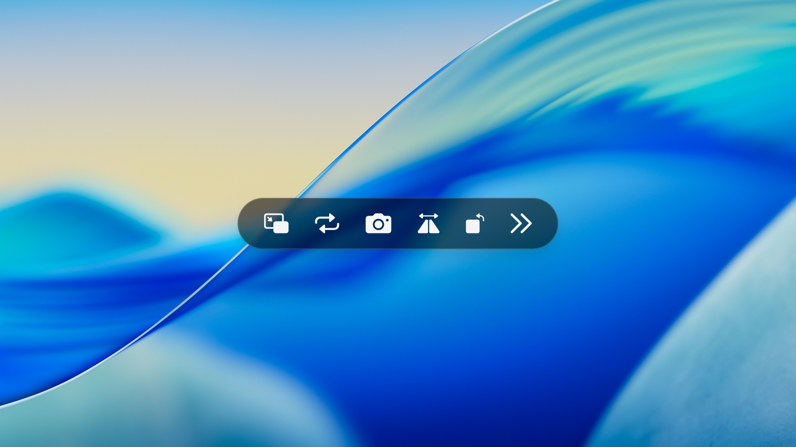

# chimo-chimo-loop

*Read this in other languages: [English](README.md), [日本語](README.ja.md)*

一款轻量级的用户脚本，为 HTML5 视频新增功能强大的悬浮控制条，支持画中画、A-B 循环、倍速调节、无损截图及硬核媒体信息统计。

> 主要在 **macOS 的 Safari** 上测试。同时也兼容 Chromium 系浏览器（如 Edge）。

## 功能与快捷键

> 💡 **修饰键：** Windows 系统请使用 `Alt` 键，macOS 系统请使用 `Option (⌥)` 键。
> *注：在输入框或文本区打字时，快捷键会自动智能禁用，避免冲突。*

| 功能 | 说明 | 快捷键 |
| :--- | :--- | :--- |
| 🔳 **画中画** | 切换悬浮视频模式。 | `⌥` + `P` |
| 🔁 **A-B 循环** | 按 `L` 开启全片循环（并自动设为 A 点）。 再按 `B` 锁定 B 点并开始区间循环。 | `⌥` + `L` / `B` |
| 📸 **无损截图** | 截取 1:1 原始分辨率的高清 PNG 画面，无任何 UI 遮挡。 | `⌥` + `S` |
| 🪞 **空间控制** | 按 `M` 镜像翻转画面。 按 `R` 以 90° 增量旋转（带自适应缩放防裁切）。 | `⌥` + `M` / `R` |
| ⏩ **播放速度** | `-` 减速，`=` 加速 (0.5x ~ 2.0x)。 `0` 一键恢复 1.0x 正常速度。 | `⌥` + `-` / `=` / `0` |
| ⏪ **播放控制** | `Space` 播放 / 暂停。 `←` / `→` 后退 / 快进 5 秒。 | `⌥` + `Space` / `←` / `→` |
| 🔊 **音频控制** | `↑` / `↓` 增加 / 减小 10% 音量。 `U` 切换静音。 | `⌥` + `↑` / `↓` / `U` |
| 📊 **媒体统计** | 开启/关闭实时 FPS、分辨率及色彩空间追踪面板。 | `⌥` + `I` |
| 👻 **自动隐藏** | 鼠标无操作 3 秒后，UI 控制条优雅淡出。 | - |

> **💡 进阶玩法：** 配合 **A-B 循环**与 **0.5 倍速**，能极大地提升吉他指弹（左右手配合）或复杂舞蹈动作的扒谱与学习效率。

## 兼容性说明

- **广泛适用**：适用于大多数使用原生 HTML5 `<video>` 元素的页面。
- **功能优先级**：若目标网站已内置相同功能，建议优先使用网站原生功能以获得最佳兼容性。
- **行为说明**：某些网站采用非标准播放逻辑，可能导致脚本状态与实际行为不完全一致。

## 安装方法

**[🚀 前往 GreasyFork 安装](https://greasyfork.org/scripts/556184)**

---

> *"See you in the next loop."*